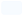
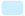
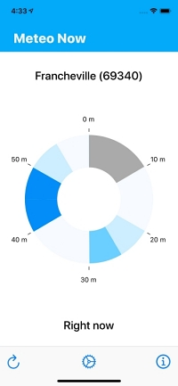
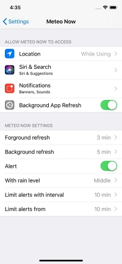
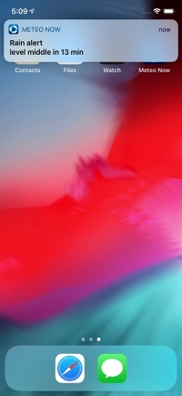
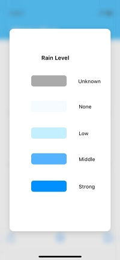

# Meteo Now App

## About

This application is an iPhone app that provides localized real-time rain forecast display and configurable alerts based on Meteo France forecast service.

### Features

+ Realtime geolocalized forecast display.

+ Background forecast fetch.

+ Configurable alerts.

+ Battery and network data-friendly.

## Build Install

Compile and launch with XCode.

## Install

Use prebuilt distribution on the [App Store](https://apps.apple.com/fr/app/meteo-now/id1475109822).

## Usage

+ Launch the application, main screen display and refresh automatically.

+ Forcast display is constantly interpolated from the latest available forcast. 
Colors display rain level forecast by Méteo France:

 &nbsp;&nbsp;&nbsp;&nbsp;&nbsp;&nbsp; Unknown

 &nbsp;&nbsp;&nbsp;&nbsp;&nbsp;&nbsp; None
	
 &nbsp;&nbsp;&nbsp;&nbsp;&nbsp;&nbsp;  Low
	
 &nbsp;&nbsp;&nbsp;&nbsp;&nbsp;&nbsp;  Middle
	
 &nbsp;&nbsp;&nbsp;&nbsp;&nbsp;&nbsp;  Strong

Press center of the screen to display color legend. 

### Button bar 

 &nbsp;&nbsp;&nbsp;&nbsp;&nbsp;&nbsp; Display refresh

 &nbsp;&nbsp;&nbsp;&nbsp;&nbsp;&nbsp; Modify settings

 &nbsp;&nbsp;&nbsp;&nbsp;&nbsp;&nbsp; Get application information.

### Specific settings 

These values are indicative. They depend heavily on iOS scheduling policy. They take effect at application startup. 

+ Foreground refresh

+ Data refresh rate when the app is displayed.

+ Background refresh

+ Data refresh rate when the app is in the background.

+ Alert

+ Activate forecast alerts.

+ With rain level

+ Limit alerts above this rain level.

+ Limit alerts with interval

+ Do not re-alert if an alert has been notified in this interval. 

## Test

Lauch tests with XCode.

## Authors

[**Nicolas Witczak**](https://github.com/nicolas800)

## Screenshots

&nbsp;&nbsp;&nbsp;&nbsp;&nbsp;&nbsp;&nbsp;&nbsp;&nbsp;